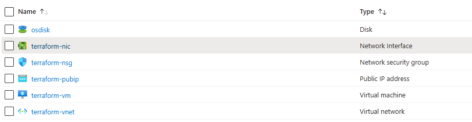

## Terraform practice01

- Doc: TODO
- Setup with Azure: https://github.com/TheDevOpsHub/TerraformHub/blob/main/Azure/docs/terraform-azure-setup.md

## What?

At the end of this practice, you will be able to create srouce group as below:


## Structure

```bash
.
├── README.md
├── main.tf
├── modules
│   ├── network
│   │   ├── main.tf
│   │   ├── outputs.tf
│   │   ├── variables.tf
│   │   └── vnet.tf
│   └── vm
│       ├── main.tf
│       ├── outputs.tf
│       ├── variables.tf
│       └── vm.tf
├── outputs.tf
├── provider.tf
├── terraform.tfvars
└── variables.tf
```

## Run

```bash
cd cd topics/terraform/terraform-practice01

# Create terraform.tfvars file
cp terraform.tfvars.sample terraform.tfvars
## Change the password to your own choice :)

terraform init

terraform plan -out="tfplan.out"

terraform apply "tfplan.out"
```

## Verify

- Check on Azure portal: https://portal.azure.com/
- Get PublicIP and try SSH to the new VM

```bash
ssh azureuser@public_IP
# Login with password defined in your `terraform.tfvars` file
```
